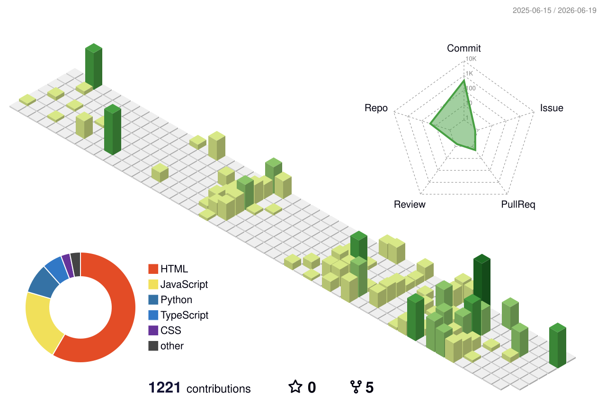

  <strong>Building practical products at the intersection of software, education, and computer vision.</strong>

  
  
  
  

  
  

## About me

I'm a Computer Science student at **Vidyavardhaka College of Engineering** who enjoys turning ideas into accessible, reliable software. My work spans full-stack web development, educational technology, and computer vision.

- Building learning experiences for students and teachers
- Exploring AI/ML and real-time computer vision
- Designing clean, responsive interfaces backed by useful APIs
- Speaking English, हिंदी, and ಕನ್ನಡ
- Open to thoughtful collaborations in EdTech, AI/ML, and web development

## Selected work

<table>
  <tr>
    <td width="50%" valign="top">
      <h3><a href="https://github.com/Majenayu/Python_Boot_Camp">Python Boot Camp</a></h3>
      
An educational quiz platform designed for government schools, with multilingual learning, live quiz rooms, teacher tools, and student analytics.

      

        
        
      

    </td>
    <td width="50%" valign="top">
      <h3><a href="https://github.com/Majenayu/CodeBreakers-vvce">Virtual Try-On</a></h3>
      
An interactive browser experience that uses pose detection and canvas rendering to preview clothing overlays in real time.

      

        
        
        
      

    </td>
  </tr>
  <tr>
    <td width="50%" valign="top">
      <h3><a href="https://github.com/Majenayu/Infosys">TrackSmart</a></h3>
      
A delivery tracking system exploring QR workflows, GPS updates, role-based portals, and service-oriented Flask architecture.

      

        
        
        
      

    </td>
    <td width="50%" valign="top">
      <h3><a href="https://github.com/Majenayu/NCC-VVCE-ATTENDENCE">NCC Attendance</a></h3>
      
An attendance management system for cadets with image uploads, authentication, date-based records, and report exports.

      

        
        
        
      

    </td>
  </tr>
  <tr>
    <td width="50%" valign="top">
      <h3><a href="https://github.com/Majenayu/Face-recognization">Face Recognition System</a></h3>
      
A computer vision project for face detection and recognition using OpenCV, with webcam support, confidence scoring, and model persistence.

      

        
        
      

    </td>
    <td width="50%" valign="top">
      <h3><a href="https://github.com/Majenayu/Majen_Eye">Majen Eye</a></h3>
      
A playful React experiment with cursor-following behavior, eye animations, and responsive motion design.

      

        
        
        
      

    </td>
  </tr>
</table>

## Toolkit

### Languages & application development

### Data, AI & computer vision

### Tools & deployment

## GitHub at a glance

  
<strong>More contribution views</strong>

   

  <picture>
    <source media="(prefers-color-scheme: dark)" srcset="./profile-3d-contrib/profile-night-green.svg" />
    <source media="(prefers-color-scheme: light)" srcset="./profile-3d-contrib/profile-green.svg" />
    
  </picture>

    

  

  
These visualizations are generated assets and may reflect the date they were last updated.

## Current direction

| Building | Learning | Looking for |
| --- | --- | --- |
| Accessible EdTech tools | Deep learning and computer vision | Collaborations that create real value |
| Useful full-stack products | Cloud architecture and microservices | Open-source projects to contribute to |
| Simple interfaces for complex ideas | Docker and Kubernetes | Opportunities to keep growing |

## Let's connect

If you’re working on **EdTech, AI/ML, computer vision, or full-stack products**, I’d love to hear about it.

<a href="mailto:pgayushrai@gmail.com">Email</a> ·
<a href="https://pgayushrai.onrender.com">Portfolio</a> ·
<a href="https://www.linkedin.com/in/p-g-ayush-rai-8b90082a9/">LinkedIn</a> ·
<a href="https://github.com/Majenayu">GitHub</a>

  

Thanks for stopping by.

